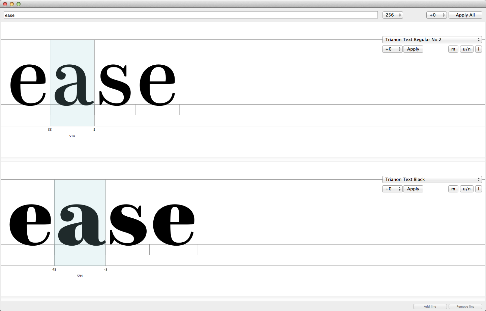
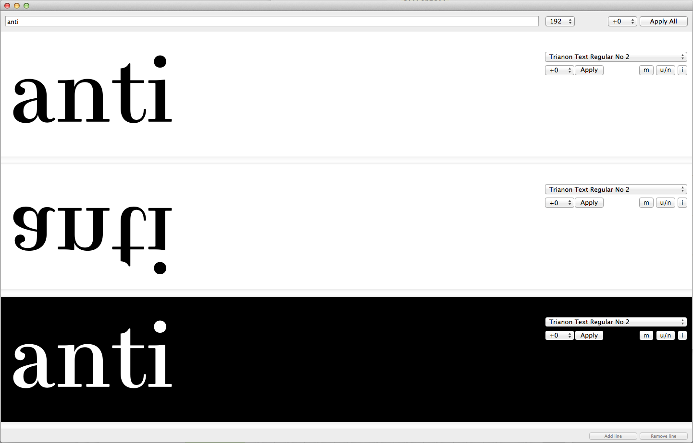
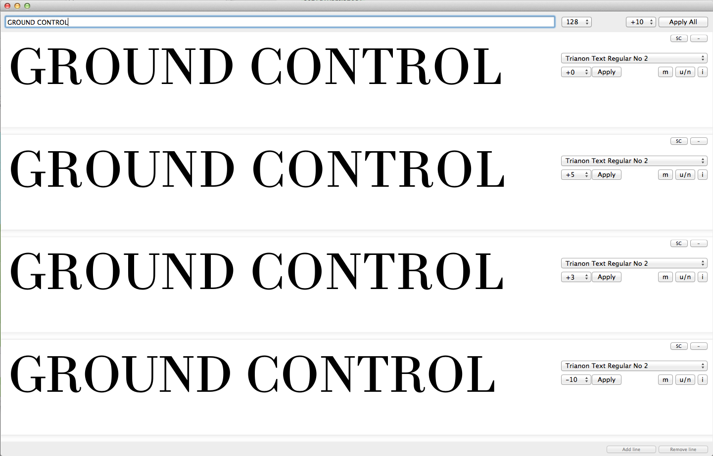

Ground Control
==============

### Principle

At first, I started writing this script only to have a window in which I could display glyphs, words or text set while I’m working on several fonts (for instance, masters of a family). In the process, I was suggested that being able to modify tracking might be interesting given the overview. So it came that I added a few more features to make the window a bit more useful (at least in my workflow). 

### Basic functionality

+ Opens a window in which all open fonts are displayed (up to 9).
+ The list of available fonts (all open ones) updates itself on opening/closing of fonts.
+ Any font closed while Ground Control is open is automatically taken out of the window (not as obvious as it sounds, at least to me).
+ You can input text that is simultaneously set on each line of type in the preview.
+ Then, on each line separately, you can modify tracking, display options (show metrics, white on black, upside down) and send the current font to a Space Center window to modify spacing.
+ Also, alt+click on a glyph opens a new Glyph Window.
+ Display options can be set on each line or globally depending on selection (or absence thereof).
+ Selection is indicated in the footer of the window, it displays “All” when no line is selected, or the name of the font on the selected line (and the number of the line).
+ On each line, you can switch between any open font, at any time.
+ Ultimately, you can also apply global tracking, and for each font, global and local tracking can be applied in an additive way. To put it simply: you get what you see.
+ Note that the displayed tracking values stand for the added distance between two glyphs. If you apply said tracking, only half of the displayed value will be added to each side of each glyph (tracking of +10 corresponds to +5 on either side of all glyphs).

